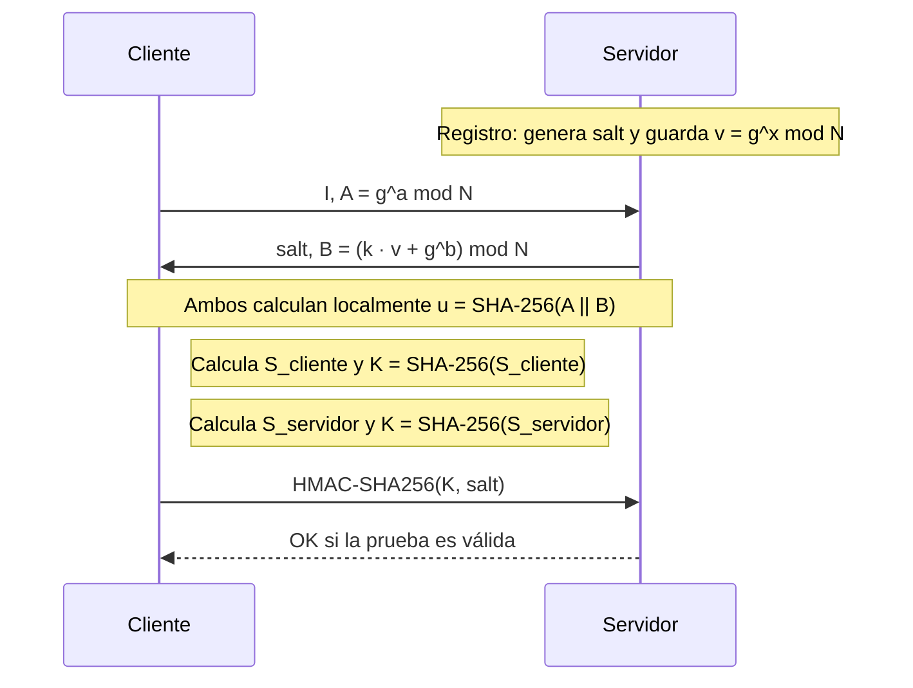

# Aprendizajes

Este documento recoge las ideas principales que vamos descubriendo al resolver
los retos de Cryptopals.

## Reto 4: detectar texto cifrado con XOR de un byte

El fichero de entrada contiene una línea cifrada con XOR de un byte entre muchas
líneas hexadecimales que no lo están. `challenge4.c` abre el fichero indicado
en la línea de comandos, lee una línea cada vez y elimina el salto de línea.
Cada línea representa bytes en hexadecimal: dos caracteres por cada byte.

En un cifrado XOR de un byte, una única clave `k` se repite para todos los
bytes:

```text
C[i] = P[i] XOR k
```

XOR es su propia inversa, por lo que se descifra con la misma operación:

```text
P[i] = C[i] XOR k
```

`fixed_xor_try()` aprovecha que la clave solo puede tener 256 valores. Para
cada valor entre `0x00` y `0xFF`, `generate_key()` crea su repetición con la
misma longitud que la línea y `fixed_xor()` aplica XOR byte a byte. Así obtiene
256 textos candidatos para cada línea, sin necesidad de conocer la clave.

Después, `score_hex_ascii_text()` valora cada candidato. La función suma más
puntos para espacios y letras frecuentes en inglés, como `t`, `e`, `a`, `i` u
`o`; los caracteres que no son letras ni espacios no aportan puntos. Se guarda
la clave y el texto de mayor puntuación de esa línea. `challenge4.c` compara
ese mejor resultado con el de las líneas anteriores y conserva el máximo
global en `candidate_line`.

Finalmente, `print_hex_as_ascii()` convierte de hexadecimal a texto el
candidato ganador. La puntuación es una heurística, no una prueba
criptográfica: puede fallar con textos cortos, idiomas distintos o contenido
que incluya muchos dígitos y signos de puntuación. Para este reto funciona
porque el texto oculto es inglés normal y destaca frente a resultados
aleatorios.

## Reto 5: XOR de clave repetida

El reto 5 implementa el cifrado XOR de clave repetida en
`src/repeating_xor.c`. A diferencia del reto 4, la clave no se limita a un
solo byte: sus bytes se reutilizan cíclicamente hasta cubrir todo el mensaje.
Para un texto `P` y una clave de longitud `m`, el cifrado es:

```text
C[i] = P[i] XOR K[i mod m]
```

Como XOR es reversible, descifrar usa exactamente la misma operación y la
misma clave. Con la clave `ICE`, por ejemplo, el cuarto byte vuelve a usar
`I`, el quinto `C` y el sexto `E`.

La función `repeating_xor()` trabaja con cadenas de texto que codifican bytes
en hexadecimal. Por eso comprueba que la entrada tenga un número par de
caracteres y avanza de dos en dos: `input_aux` y `key_aux` convierten cada par
hexadecimal a un byte, se aplica XOR, y el resultado se vuelve a escribir como
dos dígitos hexadecimales. Los índices de la clave se calculan con módulo para
volver al principio cuando se agota.

Las pruebas de `tests/challenge5_tests.cpp` convierten el texto ASCII y la
clave a hexadecimal con `ascii2hex_ascii()`. Verifican casos de error, un byte
idéntico que produce `00`, un fragmento corto y el texto completo con la clave
`ICE`.

Este esquema también se conoce como XOR de clave repetida o un Vigenère sobre
bytes. No es seguro: cada posición separada por la longitud de la clave se
cifra con el mismo byte de clave, lo que deja patrones estadísticos. Si se
estima la longitud de la clave, el criptograma puede dividirse en columnas y
atacar cada una como un XOR de un byte, que es la idea del reto 6.

## Reto 6: romper XOR de clave repetida

`challenge6.c` recibe un criptograma codificado en Base64. Primero concatena
sus líneas, lo decodifica con `base642bin()` y trabaja desde entonces con bytes
binarios. El objetivo es recuperar tanto la longitud de la clave repetida como
sus bytes.

El primer paso, `best_keysize()`, prueba longitudes de clave entre 2 y 39. Para
cada longitud divide el criptograma en bloques de ese tamaño y mide cuántos
bits son distintos entre bloques consecutivos. Esa es la distancia de Hamming,
que `hamming_distance()` calcula recorriendo los ocho bits de cada byte.

La distancia de Hamming es simplemente el número de posiciones de bits que
difieren entre dos datos de la misma longitud. Por ejemplo:

```text
A       = 01001001
B       = 01001111
A XOR B = 00000110
```

El resultado de XOR tiene dos bits a `1`, así que la distancia entre `A` y `B`
es 2. XOR deja un bit a `1` exactamente cuando los dos bits de entrada son
distintos; por eso contar sus bits a `1` produce la distancia.

La distancia se normaliza dividiéndola por la longitud del bloque y se promedia
para poder comparar claves de tamaños distintos. Funciona como estimador porque
la longitud correcta alinea los bloques con el período de la clave. Si la clave
mide `k` bytes, para dos posiciones separadas por `k` se cumple:

```text
C[i]     = P[i]     XOR K[i mod k]
C[i + k] = P[i + k] XOR K[i mod k]

C[i] XOR C[i + k] = P[i] XOR P[i + k]
```

Los dos bytes de clave se cancelan al aplicar XOR. Por eso, la distancia de
Hamming entre bloques cifrados de tamaño `k` coincide con la distancia entre
los fragmentos correspondientes de texto plano. El texto natural no es
aleatorio —contiene letras, espacios y patrones—, de modo que sus fragmentos
suelen diferir en menos bits que secuencias de bytes aleatorios.

Con una longitud candidata incorrecta, los bloques no se alinean con la clave:

```text
C[i] XOR C[i + n] = P[i] XOR P[i + n] XOR K[a] XOR K[b]
```

Normalmente `a` y `b` son distintos. La diferencia adicional entre ambos bytes
de clave introduce ruido y eleva la distancia media. Por ello, una longitud
con distancia normalizada baja es una buena candidata.

No es una garantía: con poco texto las medias pueden ser engañosas y un
múltiplo de la longitud real también puede alinear la clave y puntuar bien.
Conviene conservar varios tamaños candidatos y probar el descifrado completo
con todos ellos, en lugar de fiarse de un único mínimo.

Una vez estimado `best_keysiz`, el programa transpone el criptograma. La
columna `c` contiene los bytes de índices `c`, `c + best_keysiz`,
`c + 2 * best_keysiz`, etc. Todos ellos fueron cifrados con el mismo byte de
clave, por lo que cada columna equivale a un problema del reto 4.

`fixed_xor_bin_try()` prueba los 256 valores para ese byte, aplica XOR a la
columna y usa `score_bytes()` para elegir el resultado que más se parece a
texto inglés. El byte ganador se guarda en `key[c]`. Finalmente, el bucle
`plain[i] = bin[i] ^ key[i % best_keysiz]` aplica la clave reconstruida al
criptograma completo y recupera el texto.

Además, hay un límite que corregir en la versión actual de `best_keysize()`:
cuenta `blocks` bloques completos, pero compara cada uno con el siguiente,
incluido el último. Ese último acceso puede leer más allá de `bin`; debe
comparar solo `blocks - 1` pares y dividir la media entre el número de pares
realmente comparados.

## Reto 8: detectar AES en modo ECB

El reto recibe un fichero con varios criptogramas, uno por línea y codificados
en hexadecimal. `challenge8.c` convierte cada línea a bytes con `str2bytes()`
y la divide conceptualmente en bloques de 16 bytes, que es el tamaño de bloque
de AES.

ECB cifra cada bloque de manera independiente y determinista con la misma
clave:

```text
Cᵢ = AESₖ(Pᵢ)
```

Por ello, dos bloques de texto plano idénticos producen dos bloques cifrados
idénticos:

```text
Pᵢ = Pⱼ  =>  AESₖ(Pᵢ) = AESₖ(Pⱼ)  =>  Cᵢ = Cⱼ
```

Esta propiedad filtra patrones del mensaje. Por ejemplo, una imagen con zonas
uniformes o un texto con muchas repeticiones seguirá mostrando bloques iguales
después de cifrarse en ECB. En modos encadenados, como CBC con un IV adecuado,
los bloques iguales no tienen por qué producir el mismo resultado.

`aes128_check_repeated_blocks()` compara todos los pares distintos de bloques
de una línea mediante `memcmp()`. Incrementa la puntuación por cada pareja
idéntica; si un valor aparece tres veces, aporta tres parejas coincidentes. El
programa muestra las líneas cuya puntuación es mayor que cero, que son las
candidatas a haber sido cifradas en ECB.

La repetición no demuestra por sí sola que se haya usado ECB: puede existir una
colisión accidental, aunque entre bloques AES de 128 bits es extremadamente
improbable, o el dato puede contener bloques repetidos sin ser un criptograma
ECB. En este reto los datos están construidos para que la línea ECB contenga
repeticiones claras. La lección práctica es no usar ECB para datos
estructurados; un modo autenticado como AES-GCM evita tanto esta filtración de
patrones como la falta de integridad.

## Reto 9: padding PKCS#7

Los cifrados por bloques, como AES, procesan cantidades exactas de un bloque:
AES usa bloques de 16 bytes. Si el mensaje no ocupa un número múltiplo del
tamaño de bloque, no puede cifrarse directamente en modos como ECB o CBC. El
*padding* rellena el final del mensaje para alcanzar ese múltiplo.

PKCS#7 usa como relleno el número de bytes que se añaden, repetido una vez por
cada byte de padding. Para un mensaje de longitud `n` y bloques de tamaño `B`:

```text
p = B - (n mod B)
```

Se añaden `p` bytes, todos con el valor `p`. Por ejemplo, para el texto de 16
bytes `YELLOW SUBMARINE` y un bloque de 20 bytes, se añaden cuatro bytes:

```text
YELLOW SUBMARINE 04 04 04 04
```

Si faltan tres bytes para completar un bloque de cuatro, se añaden
`03 03 03`. Un caso importante es el de un mensaje que ya ocupa un bloque
completo: PKCS#7 añade un bloque entero. Con 16 bytes y bloques de 16, el
resultado termina en dieciséis bytes `10`. Esto permite diferenciar un último
byte de datos con valor `01`, por ejemplo, de un byte de padding.

`pkcs7_needed_pad()` calcula `p` y `pkcs7_pad()` escribe esos bytes al final
del buffer. La función requiere que el llamador proporcione capacidad suficiente
para el mensaje y el padding; devuelve el número de bytes añadidos o `-1` ante
un error.

Al descifrar, `pkcs7_unpad()` toma el último byte como longitud candidata del
relleno. Lo acepta solo si es distinto de cero, no supera el tamaño de bloque
ni la longitud disponible, y todos los últimos `p` bytes tienen exactamente el
mismo valor. Si es válido, devuelve la longitud sin padding; si no, devuelve
`-1`. Así rechaza, por ejemplo, los finales `05 05 05 05` cuando el último byte
indica cinco bytes, o `01 02 03 04`, cuyos valores no coinciden.

El padding solo ajusta la longitud; no autentica el mensaje ni protege su
integridad. Además, exponer de forma distinguible un error de padding puede
crear un oráculo de padding, como el que se explota en el reto 17.

## Reto 10: implementar CBC a partir de ECB

El reto 10 descifra un archivo Base64 cifrado con AES-128-CBC. El programa
concatena y decodifica las líneas de entrada, usa la clave conocida `YELLOW
SUBMARINE` y un IV de ceros —valores fijados por el ejercicio— y recupera el
texto bloque a bloque.

ECB cifra cada bloque de forma independiente:

```text
Cᵢ = Eₖ(Pᵢ)
```

Por eso filtra patrones: dos bloques iguales de texto plano generan el mismo
bloque cifrado. CBC (*Cipher Block Chaining*) evita esa independencia mezclando
cada bloque con el bloque cifrado anterior antes de cifrarlo:

```text
C₀ = Eₖ(P₀ XOR IV)
Cᵢ = Eₖ(Pᵢ XOR Cᵢ₋₁)    para i > 0
```

Aunque `Pᵢ` y `Pⱼ` sean iguales, normalmente sus bloques anteriores son
distintos, por lo que sus entradas a AES y sus bloques cifrados también lo son.
El IV cumple ese papel para el primer bloque. Debe ser impredecible y nuevo
para cada cifrado con una misma clave; no necesita ser secreto y se transmite
junto al criptograma. Un IV fijo de ceros, como el usado por el reto, es útil
para reproducir el ejemplo, pero no es seguro en una aplicación real.

Para descifrar CBC se aplica primero la inversa de AES al bloque actual y luego
XOR con el bloque cifrado anterior:

```text
P₀ = Dₖ(C₀) XOR IV
Pᵢ = Dₖ(Cᵢ) XOR Cᵢ₋₁    para i > 0
```

Esto es exactamente lo que hace la `aes128_cbc_decrypt()` local de
`challenge10.c`. Inicializa OpenSSL en ECB para obtener `Dₖ(Cᵢ)` de cada bloque
de 16 bytes y `buffer_xor()` mezcla después el IV en el primer bloque o el
bloque cifrado anterior en los siguientes. Así demuestra que CBC puede
construirse a partir de una primitiva ECB y XOR.

CBC oculta los patrones que ECB deja visibles, pero no aporta autenticación:
un atacante puede modificar bloques cifrados y provocar cambios previsibles
en el siguiente bloque de texto plano. Actualmente debe preferirse un modo
autenticado, como AES-GCM o ChaCha20-Poly1305, que proporciona confidencialidad
e integridad.

## Reto 12: descifrar un sufijo secreto byte a byte en ECB

`challenge12.c` construye un oráculo de cifrado. Al iniciarse genera una clave
AES aleatoria que se mantiene fija, y `encryption_oracle()` cifra lo siguiente
en ECB:

```text
entrada_controlada || sufijo_secreto || padding_PKCS#7
```

El sufijo está codificado en Base64 en `g_unknown_string`, pero Base64 solo es
una codificación: el oráculo lo decodifica antes de cifrarlo. El atacante no
conoce ni la clave ni el sufijo, pero puede enviar tantas entradas controladas
como quiera y observar el texto cifrado resultante.

Antes del ataque, `detect_blk_size()` llama al oráculo con entradas de `A` cada
vez más largas. Cuando la longitud cifrada aumenta, ha empezado un nuevo
bloque; la diferencia de longitudes revela el tamaño de bloque, 16 bytes para
AES. `detect_ecb()` envía varios bloques idénticos de `A` y busca bloques
cifrados repetidos. La repetición confirma que el oráculo usa ECB, condición
necesaria para el ataque.

Para recuperar el byte secreto de índice `n`, el programa calcula:

```text
bloque_objetivo = n / 16
prefijo = 15 - (n mod 16)
```

Al enviar solo `prefijo` bytes `A`, el byte secreto `S[n]` queda como último
byte del bloque objetivo. El programa guarda el bloque cifrado correspondiente
como referencia.

Después crea un diccionario de 256 posibilidades. Para cada byte candidato
`g`, envía:

```text
A...A || S[0] || S[1] || ... || S[n-1] || g
```

Los bytes `S[0..n-1]` ya se recuperaron en iteraciones anteriores. Si `g` es
igual a `S[n]`, el bloque de texto plano construido por el atacante es idéntico
al bloque objetivo de la consulta de referencia. Como ECB cifra bloques iguales
con la misma clave en el mismo resultado, los bloques cifrados coinciden. La
comparación con `memcmp()` identifica el candidato correcto y el proceso se
repite para el siguiente byte.

Un ejemplo con bloques imaginarios de cuatro bytes aclara la comparación.
Supongamos que el secreto empieza por `DOG...` y queremos obtener el primer
byte. Primero enviamos tres `A`:

```text
entrada del atacante:                 AAA
texto que cifra el oráculo:           AAADOG...
primer bloque de referencia:          AAAD
```

El atacante guarda ese bloque cifrado de referencia; aquí lo llamamos cifrado
de `AAAD` porque conocemos el ejemplo, pero el atacante aún no conoce `D` ni
la clave. Luego prueba `AAAX` para cada posible byte `X`; el primer bloque
cifrado solo coincidirá con el de referencia cuando `X` sea `D`, porque
entonces ambos bloques de texto plano son `AAAD`.

Para recuperar el segundo byte, el atacante ya conoce `D`. Envía dos `A`, con
lo que el bloque de referencia pasa a ser `AADO`, y compara su cifrado con los
de `AADA`, `AADB`, `AADC`, etc. La coincidencia se produce con `AADO`, por lo
que el segundo byte es `O`. El mismo desplazamiento y la misma búsqueda se
repiten para el resto del sufijo; al cruzar un límite de bloque se compara el
siguiente bloque cifrado.

Visto como una secuencia, para cada byte nuevo se quita una `A` del prefijo.
Así se mantiene el siguiente byte secreto justo al final del bloque de
referencia:

```text
Descubrir D:  AAA + DOG...  -> bloque AAAD
Descubrir O:  AA  + DOG...  -> bloque AADO   (D ya se conoce)
Descubrir G:  A   + DOG...  -> bloque ADOG   (D y O ya se conocen)
```

En las 256 pruebas de una misma ronda el prefijo no cambia. En esas pruebas se
añade al prefijo la parte del secreto ya descubierta y únicamente se varía el
último byte. Por ejemplo, al buscar `O` se mantiene `AA` y el `D` recuperado:
`AADA`, `AADB`, `AADC`, ..., `AADO`. La coincidencia de `AADO` revela `O`.
Entonces se pasa a la siguiente ronda, se elimina otra `A` y se incorpora `O`
a los bytes ya conocidos: para buscar `G` se probarán `ADOA`, `ADOB`, ...,
`ADOG`.

La debilidad no consiste en que la clave sea corta o predecible: incluso una
clave AES aleatoria es insuficiente si un atacante puede consultar un oráculo
ECB determinista que concatena un secreto. El ataque requiere que la clave se
mantenga fija, que el atacante controle el prefijo y que no haya un prefijo
aleatorio desconocido; el caso con ese prefijo se trata en el reto 14.

El bucle actual termina cuando ningún candidato produce coincidencia. Una
implementación más robusta calcularía primero la longitud exacta del sufijo y
trataría explícitamente el padding, para no confundir el final del secreto con
un byte de padding recuperable. En sistemas reales debe evitarse ECB y usarse
cifrado autenticado con nonces o IVs adecuados.

## Reto 13: ataque ECB cut-and-paste

El reto modela una aplicación que guarda en una cookie cifrada el perfil de
cada usuario. El servidor descifra la cookie y confía en el campo `role` para
decidir sus privilegios. Un usuario normal recibe `role=user`; el objetivo del
atacante es fabricar una cookie que el servidor interprete como `role=admin`,
sin conocer la clave AES ni poder pedir ese rol directamente.

Hay dos operaciones que, en una aplicación real, pertenecerían al servidor:

1. `profile_for(email)` recibe el correo enviado por el cliente y crea el
   texto de perfil.
2. `encrypt_profile(profile)` aplica padding y devuelve el perfil cifrado que
   el servidor entregaría al navegador como cookie.

`main()` llama ambas funciones directamente porque es una demostración local.
No significa que el atacante pueda invocar funciones internas del servidor:
el supuesto del reto es que puede usar repetidamente el endpoint normal de
registro o actualización de perfil, elegir el valor de su correo y recibir la
cookie cifrada resultante. No puede solicitar que el servidor asigne
`role=admin`; todos los perfiles que el servidor genera tienen inicialmente
`role=user`.

El texto que el servidor forma tiene este formato:

```text
email=<correo>&uid=10&role=user
```

El *filtrado de caracteres* es una validación de la entrada. `profile_for()`
busca `&` y `=` dentro del correo y rechaza la petición si encuentra alguno.
Esos caracteres tienen significado en este formato: `&` separa campos y `=`
asigna un valor. Sin ese filtro, un atacante podría enviar literalmente:

```text
alice@example.com&role=admin
```

y conseguir que el texto del perfil incorporase otro campo `role`. Con el
filtro, esa inyección directa falla; el atacante solo puede elegir correos sin
`&` ni `=`. Por ejemplo, el servidor acepta `AAAAAAAAAAAAA` y devuelve el
perfil cifrado correspondiente. Después `encrypt_profile()` aplica PKCS#7 y
cifra el perfil con AES-ECB bajo una clave aleatoria fija que el atacante no
conoce.

El filtrado de caracteres no basta porque ECB cifra cada bloque de 16 bytes de
forma independiente y determinista. Si se conoce el contenido y la alineación
de un bloque, su cifrado puede copiarse a otra posición sin descifrarlo:

```text
Eₖ(P) = C  =>  insertar C en otro criptograma produce P al descifrar
```

Primero el programa solicita el perfil del correo con trece `A`:

```text
email=AAAAAAAAAAAAA&uid=10&role=user
|------ bloque 0 ------|------ bloque 1 ------| bloque 2
```

`email=` ocupa 6 bytes; con 13 `A` y los 13 bytes de `&uid=10&role=` se llega
exactamente a 32 bytes. Por tanto, `user` y su padding ocupan el último bloque.
Ese es el bloque que se quiere reemplazar.

Después construye otro correo con diez `A`, seguido de `admin` y once bytes
`0x0b`. El prefijo `email=` más las diez `A` llenan el primer bloque; el segundo
queda exactamente así:

```text
admin 0b 0b 0b 0b 0b 0b 0b 0b 0b 0b 0b
```

Es un bloque PKCS#7 válido: `admin` tiene 5 bytes y los 11 bytes restantes
valen `0x0b`. El programa copia el segundo bloque cifrado de este perfil al
último bloque cifrado del primer perfil. Al descifrar el criptograma mezclado,
los dos primeros bloques siguen formando `email=...&uid=10&role=` y el último
se convierte en `admin` con padding válido. Tras eliminar el padding, el perfil
resultante indica `role=admin`.

El ataque no rompe AES: reutiliza bloques válidos producidos por el propio
servicio. Requiere una clave ECB fija, la capacidad de elegir parte del texto
plano y ausencia de autenticación. CBC sin autenticación también es maleable,
aunque el ataque concreto de copiar bloques no funciona igual por el
encadenamiento. La defensa moderna es un modo autenticado, como AES-GCM o
ChaCha20-Poly1305, que detecta cualquier modificación del criptograma.

## Reto 16: modificar datos con CBC bit flipping

Este reto representa un servicio que guarda comentarios de usuario en una
cookie cifrada. El cliente puede enviar `userdata`, pero el servidor añade por
delante y por detrás texto fijo antes de cifrarlo:

```text
comment1=cooking%20MCs;userdata=<datos del usuario>;comment2=%20like%20a%20pound%20of%20bacon
```

Cuando recibe la cookie, `is_admin()` la descifra y busca la cadena
`;admin=true;`. Si la encuentra, considera administrador al usuario. El
atacante quiere introducir esa cadena en el texto descifrado, pero no conoce la
clave AES.

No pretende sustituir el campo `userdata` ni existe un campo `role` en este
reto. El objetivo es que `;admin=true;` aparezca *dentro del valor* de
`userdata`, de modo que el texto final tenga una forma parecida a:

```text
...;userdata=;admin=true;;comment2=...
```

La comprobación es vulnerable porque busca esa subcadena en cualquier posición
del mensaje, sin validar que forme parte de un campo permitido ni comprobar la
estructura completa del comentario.

El servidor intenta impedir una inyección directa. `encrypt_userdata()` recorre
los datos recibidos y sustituye `;` por `?` y `=` por `_`. Por tanto, si el
atacante envía:

```text
;admin=true;
```

el texto que realmente se cifra contiene:

```text
?admin_true?
```

El intento normal falla porque esa cadena no contiene `;admin=true;`.

Para entender el ataque hay que partir de la regla de descifrado de CBC. Para
cualquier bloque salvo el primero:

```text
Pᵢ = Dₖ(Cᵢ) XOR Cᵢ₋₁
```

`Dₖ(Cᵢ)` es la salida de AES al descifrar el bloque actual y el bloque cifrado
anterior se aplica después con XOR. Aunque un atacante no puede calcular
`Dₖ(Cᵢ)`, sí puede modificar `Cᵢ₋₁`. Si cambia un bit de `Cᵢ₋₁`, cambia ese
mismo bit de `Pᵢ` después del XOR. En general, si quiere transformar un byte
conocido `original` en `deseado`, aplica al byte correspondiente del bloque
cifrado anterior:

```text
delta = original XOR deseado
Cᵢ₋₁' = Cᵢ₋₁ XOR delta

Pᵢ' = Dₖ(Cᵢ) XOR Cᵢ₋₁'
     = Pᵢ XOR delta
     = original XOR original XOR deseado
     = deseado
```

El prefijo fijo mide exactamente 32 bytes, es decir, dos bloques AES. Por ello
`?admin_true?` comienza al inicio del tercer bloque de texto plano, `P₂`:

```text
P₀ | P₁ | P₂
---+----+----------------
prefijo de 32 bytes | ?admin_true?...
```

Para modificar `P₂`, hay que alterar el bloque cifrado anterior, `C₁`. En el
array `cipher`, `C₁` empieza en el desplazamiento 16. El código realiza tres
cambios concretos:

```c
cipher[16]    ^= ';' ^ '?';  // byte 0:  ? -> ;
cipher[16 + 6] ^= '=' ^ '_';  // byte 6:  _ -> =
cipher[16 + 11] ^= ';' ^ '?'; // byte 11: ? -> ;
```

Los valores a la derecha de `^=` son exactamente `original XOR deseado`. Tras
el descifrado, el tercer bloque pasa de contener `?admin_true?` a contener
`;admin=true;`, aunque el servidor nunca cifró esos caracteres directamente.

Modificar `C₁` también destruye de forma impredecible el texto plano de su
propio bloque, `P₁`: AES recibe un bloque cifrado distinto y su salida cambia
por completo. Por tanto, el mensaje atacado tiene conceptualmente esta forma:

```text
P₀: texto normal
P₁: basura provocada por modificar C₁
P₂: ;admin=true;                 <- cambio controlado
P₃...: resto del comentario
```

El ataque funciona porque `is_admin()` solo busca la subcadena de
administrador en cualquier parte del texto y no valida la estructura completa
del comentario. En un servidor que exigiera que todos los campos fueran
correctos, la basura de `P₁` podría hacer fallar la petición y este ataque
concreto quizá no serviría. El padding final tampoco se toca, por lo que sigue
siendo válido.

El ataque no descifra ni rompe AES; explota que CBC sin autenticación es
maleable. Cifrar no basta para proteger datos que el cliente puede modificar:
el servidor debe verificar una autenticación antes de interpretar el contenido.
Un modo AEAD, como AES-GCM o ChaCha20-Poly1305, detectaría la modificación y
rechazaría la cookie.

## Reto 17: ataque de oráculo de padding en CBC

Imaginemos un servicio que cifra un mensaje secreto con AES-CBC y entrega al
cliente el IV y el criptograma. Más tarde acepta esos datos para descifrarlos.
El atacante no conoce la clave ni el mensaje, pero puede enviar versiones
modificadas del IV o del criptograma y observar un detalle de la respuesta:
«el padding es válido» o «el padding es inválido».

Esa respuesta de sí/no es un *oráculo de padding*. No parece revelar el texto,
pero el atacante puede hacer muchas consultas y cada una le informa sobre un
byte. En una aplicación real, el oráculo puede aparecer accidentalmente como
un código HTTP diferente, un mensaje de error distinto o una diferencia de
tiempo entre un fallo de padding y otro fallo posterior.

El padding PKCS#7 completa el último bloque con bytes iguales. Por ejemplo,
si faltan tres bytes para completar un bloque, el final debe ser:

```text
... 03 03 03
```

Al descifrar, el servicio comprueba que el último byte indique una longitud
válida y que los últimos bytes coincidan con ella. El ataque convierte esa
comprobación en una herramienta para aprender el mensaje.

Para entender por qué, consideremos un bloque cifrado `Cᵢ`. Al descifrar CBC
se calcula:

```text
Pᵢ = Dₖ(Cᵢ) XOR Cᵢ₋₁
```

Para el primer bloque, `Cᵢ₋₁` es el IV. Llamaremos `Iᵢ` al valor intermedio
`Dₖ(Cᵢ)`. El atacante no conoce `Iᵢ`, pero puede conservar `Cᵢ` y sustituir el
bloque anterior por otro bloque elegido `M`:

```text
texto que verá el servidor = Iᵢ XOR M
```

El atacante empieza por el último byte del bloque. Prueba los 256 valores
posibles para el último byte de `M` y consulta el oráculo. Cuando el oráculo
acepta el padding `01`, sabe que se ha cumplido:

```text
Iᵢ[15] XOR M[15] = 01
```

De ahí obtiene el byte intermedio:

```text
Iᵢ[15] = M[15] XOR 01
```

La operación se entiende como deshacer una máscara XOR. El oráculo ha
confirmado que `Iᵢ[15] XOR M[15]` vale `01`; el atacante conoce el valor de
`M[15]` porque lo eligió. Si aplica esa misma máscara una segunda vez a ambos
lados de la igualdad, se cancela:

```text
(Iᵢ[15] XOR M[15]) XOR M[15] = 01 XOR M[15]
Iᵢ[15] XOR (M[15] XOR M[15]) = 01 XOR M[15]
Iᵢ[15] = 01 XOR M[15]
```

Es como accionar dos veces el mismo interruptor: el segundo cambio deshace el
primero. Por ejemplo, si la prueba con `M[15] = A7` hace que el oráculo acepte
el padding `01`, entonces `Iᵢ[15] = 01 XOR A7 = A6`. Se puede comprobar que
`A6 XOR A7 = 01`.

Ya conoce `Iᵢ[15]`, aunque siga sin conocer la clave. Para recuperar el último
byte real del mensaje, aplica XOR con el byte original del bloque anterior:

```text
Pᵢ[15] = Iᵢ[15] XOR Cᵢ₋₁[15]
```

Después recupera el byte anterior. Esta vez quiere forzar un padding de dos
bytes, `02 02`. Ajusta el último byte de `M` para que `Iᵢ[15] XOR M[15]` sea
`02`, y prueba los 256 valores del byte anterior hasta que el oráculo acepte.
La aceptación implica que los dos últimos bytes son `02 02`; así obtiene
`Iᵢ[14]`. Se repite el proceso hacia la izquierda, forzando `03 03 03`, luego
`04 04 04 04`, y así hasta recuperar los 16 bytes del bloque.

El mismo procedimiento se aplica a cada bloque del criptograma. Para el primer
bloque se modifica el IV; para los demás se modifica el bloque cifrado que los
precede. Al final se elimina el padding PKCS#7 recuperado y queda el mensaje
original. Una implementación robusta también confirma las coincidencias del
último byte, porque algunas modificaciones pueden producir padding válido por
casualidad.

El ataque no rompe AES ni adivina la clave. Solo aprovecha dos propiedades:
CBC permite controlar el XOR del bloque anterior y el servicio revela si el
resultado cumple una regla de padding. La defensa es autenticar el mensaje
antes de interpretarlo, preferiblemente con AEAD como AES-GCM o
ChaCha20-Poly1305, y no exponer errores de descifrado distinguibles.

## Reto 19: romper CTR con nonce reutilizado

El reto cifra cuarenta líneas de texto con AES en modo CTR. Cada línea usa la
misma clave AES y, de forma intencionadamente insegura, el mismo nonce `0`.
Las líneas se presentan codificadas en Base64, que se decodifica antes de
cifrarlas; Base64 no aporta protección criptográfica.

CTR convierte AES en un cifrador de flujo. Para cada posición genera bytes de
*keystream* cifrando con AES un bloque formado por un nonce y un contador:

```text
keystream = AESₖ(nonce || contador)
cifrado   = texto_plano XOR keystream
```

Para descifrar se aplica el mismo XOR:

```text
texto_plano = cifrado XOR keystream
```

El contador aumenta dentro de cada mensaje. La seguridad depende de que la
pareja `(clave, nonce)` no se repita nunca: con la misma clave y el mismo
nonce, el contador vuelve a empezar en cero y se genera exactamente el mismo
keystream para todos los mensajes.

Si `K[j]` es el byte de keystream de la posición `j`, para cada línea se
cumple:

```text
C[i][j] = P[i][j] XOR K[j]
```

Es la misma situación que tener muchos mensajes cifrados con la misma clave
XOR, alineada por posiciones. Cada columna de bytes cifrados —el byte cero de
todas las líneas, después el byte uno, etc.— se ha combinado con el mismo
`K[j]`. El reto puede atacar cada columna de forma independiente.

Para una posición `j`, se prueban los 256 valores posibles de `K[j]`. Cada
valor candidato se aplica a todos los criptogramas que tengan un byte en esa
posición. Si el resultado contiene letras y espacios con frecuencias propias
del inglés, recibe una puntuación alta; el candidato con mejor puntuación se
guarda como el byte de keystream de esa columna. Al repetirlo hasta la longitud
de la línea más larga se reconstruye un prefijo del keystream y se descifran
todas las líneas con él.

La estimación es estadística. Las columnas con muchas líneas aportan evidencia
suficiente, pero al final de las líneas largas quedan pocas muestras y pueden
aparecer letras erróneas, signos de puntuación mal recuperados o puntos en la
salida. Con más texto, un mejor modelo de idioma o correcciones manuales se
puede mejorar el resultado.

Este fallo también se conoce como reutilización de *one-time pad* o
*many-time pad*: XOR con el mismo keystream dos veces expone relaciones entre
los textos. AES-CTR es seguro solo si cada mensaje usa un nonce único bajo una
misma clave. En protocolos modernos conviene usar AEAD, como AES-GCM o
ChaCha20-Poly1305, y gestionar los nonces de modo que nunca se repitan.

## Reto 23: clonar un MT19937 a partir de sus salidas

MT19937 no es un generador criptográficamente seguro. Aunque su estado interno
tiene 624 palabras de 32 bits, cada llamada al generador expone una palabra de
ese estado después de aplicar una transformación reversible denominada
*tempering*.

La salida se calcula aplicando estas operaciones XOR y desplazamientos:

```c
y ^= y >> 11;
y ^= (y << 7) & 0x9D2C5680;
y ^= (y << 15) & 0xEFC60000;
y ^= y >> 18;
```

Para recuperar el estado original hay que deshacerlas en orden inverso. Un XOR
con un desplazamiento puede invertirse de forma iterativa: los bits que no
dependen de otros se conservan y permiten recuperar progresivamente los demás.
Por eso, al deshacer una operación se parte de la salida conocida y se repite
la misma relación hasta reconstruir los 32 bits.

Al observar 624 salidas consecutivas y aplicar `untemper` a cada una obtenemos
las 624 palabras del estado interno. Si el clon deja su índice en 624, ambos
generadores ejecutarán el mismo `twist` antes de producir la siguiente salida,
por lo que a partir de ese momento entregarán exactamente la misma secuencia.

La conclusión práctica es importante: MT19937 sirve para simulaciones o usos
no sensibles, pero nunca para generar secretos, tokens de sesión, nonces ni
claves. Si un atacante puede observar suficientes salidas, puede predecir todas
las futuras.

## Reto 24: semillas de 16 bits

Una semilla de 16 bits solo tiene 65.536 valores posibles. Aunque se genere
con una fuente criptográficamente segura, ese espacio es lo bastante pequeño
para probar exhaustivamente todas las semillas y recuperar la correcta si se
conoce parte del texto plano. La calidad de la fuente aleatoria no compensa un
tamaño de semilla insuficiente.

Un cifrador de flujo genera una secuencia de bytes (*keystream*) y aplica XOR
byte a byte con el texto plano. En este reto, cada salida de 32 bits de MT19937
se divide explícitamente, de menos a más significativo, en cuatro bytes de la
secuencia.

MT19937 es determinista: inicializarlo de nuevo con la misma semilla produce
el mismo *keystream*. Como XOR es su propia inversa, esa misma rutina sirve
para cifrar y descifrar siempre que reciba la misma semilla.

Un sufijo conocido de texto plano permite comprobar candidatas a semilla: se
descifra el final del mensaje con cada *keystream* candidato y se busca que
coincida con ese sufijo. En este reto usamos catorce caracteres `A` conocidos.
Recorrer las 65.536 semillas posibles es un ataque de fuerza bruta asequible.

Un timestamp no es una semilla secreta: un atacante puede aproximar el momento
de creación de un token y probar las semillas de ese intervalo. Por ello,
MT19937 inicializado con la hora actual tampoco sirve para crear tokens de
seguridad.

Si se conoce que el token se generó hace menos de 256 segundos, basta con
probar esos timestamps recientes y comparar los tokens generados. El espacio
de búsqueda queda reducido a unas pocas centenas de candidatas.

Para reproducir el ataque no es necesario esperar físicamente: se puede
simular un instante posterior al de creación y buscar hacia atrás desde él.

## Reto 25: romper un oráculo de edición aleatoria en CTR

CTR permite acceder a una posición concreta de un criptograma sin procesar los
bytes anteriores: basta con generar el byte de *keystream* de esa posición. Esa
propiedad puede ser útil para editar datos cifrados, pero se vuelve peligrosa
si una API expone la edición a un atacante y le devuelve el criptograma
resultante.

El escenario es el siguiente: el servidor cifra un texto con una clave y un
nonce que el atacante no conoce. El atacante recibe el criptograma original y
puede llamar a un oráculo de esta forma:

```text
edit(criptograma, offset, texto_nuevo) -> criptograma_editado
```

El oráculo sustituye `texto_nuevo` en el texto plano a partir de `offset` y
vuelve a cifrar esa región con la misma clave, nonce y contador. No revela ni
la clave ni el texto plano original.

En CTR, para cada posición se cumple:

```text
C = P XOR K
```

donde `P` es el texto plano, `C` el criptograma y `K` el keystream. Para
editar una región, el oráculo genera el mismo `K` en esa posición y calcula:

```text
C_editado = P_nuevo XOR K
```

La debilidad aparece porque el atacante puede elegir `P_nuevo`. Si sustituye
todo el texto por bytes cero, la salida del oráculo es:

```text
C_editado = 00 XOR K = K
```

Es decir, el supuesto criptograma editado es directamente el keystream del
mensaje. El atacante ya tenía el criptograma original, así que recupera el
texto plano con un último XOR:

```text
P = C XOR K
```

En el programa, se crea un buffer de ceros de la misma longitud que el
criptograma, se solicita al oráculo una edición desde el desplazamiento cero y
se guarda la respuesta como `keystream`. Después `fixed_xor_bin()` combina ese
keystream con el criptograma original y obtiene el texto plano completo.

No hace falta reutilizar el nonce entre mensajes para que este ataque funcione:
basta poder editar y obtener la salida del mismo mensaje. El problema es que
el oráculo ofrece cifrado elegido con el keystream secreto y permite pedir el
caso especial de texto plano cero. Una API de edición debe estar protegida por
autorización y no debe entregar a un atacante un resultado que pueda usarse
para reconstruir el keystream. Para datos sensibles conviene además usar un
modo autenticado que detecte modificaciones no autorizadas.

## Reto 26: CTR bit flipping

El escenario es el mismo que en el reto 16: el servidor inserta datos de
usuario dentro de un comentario y decide que el usuario es administrador si,
tras descifrar, encuentra la cadena `;admin=true;`:

```text
comment1=cooking%20MCs;userdata=<datos del usuario>;comment2=...
```

Para evitar una inyección directa, el servidor sustituye los caracteres `;` y
`=` recibidos del usuario por `?` y `_`. Por tanto, cuando el atacante envía
`;admin=true;`, el texto que se cifra contiene el fragmento conocido:

```text
?admin_true?
```

En CTR no hay encadenamiento entre bloques. Cada byte se cifra de forma
independiente con el byte correspondiente del keystream:

```text
C = P XOR K
```

Si el atacante modifica un byte del criptograma aplicándole una máscara
`delta`, el servidor descifra:

```text
C' = C XOR delta
P' = C' XOR K
   = (C XOR delta) XOR K
   = P XOR delta
```

Así que la misma máscara modifica de forma predecible el byte de texto plano
en la misma posición. Para transformar un valor conocido `original` en otro
`deseado`, se usa:

```text
delta = original XOR deseado
```

El prefijo fijo mide 32 bytes. Por eso el primer carácter de los datos de
usuario está en `cipher[32]`. El ataque aplica las máscaras necesarias sobre
los tres caracteres sanitizados:

```text
cipher[32] ^= '?' XOR ';';  // ? -> ;
cipher[38] ^= '_' XOR '=';  // _ -> =
cipher[43] ^= '?' XOR ';';  // ? -> ;
```

Después del descifrado, el fragmento pasa de `?admin_true?` a
`;admin=true;`. El verificador encuentra esa subcadena y concede privilegios
de administrador, aunque la clave y el keystream sigan siendo desconocidos
para el atacante.

La diferencia esencial con CBC es que CTR no daña ningún byte vecino: cambiar
un byte de `C` cambia solo el byte equivalente de `P`. Esto hace el ataque más
directo, pero no menos grave. CTR proporciona confidencialidad, no integridad;
un atacante que pueda modificar el criptograma puede alterar el mensaje de
forma controlada. La defensa es usar cifrado autenticado, como AES-GCM o
ChaCha20-Poly1305, y rechazar cualquier mensaje cuya autenticación falle.

## Reto 27: recuperar la clave cuando IV = Key en CBC

En CBC, la clave AES y el IV tienen funciones distintas. La clave debe ser
secreta y puede reutilizarse durante su vida útil; el IV no es secreto, pero
debe ser independiente de la clave y, normalmente, nuevo e impredecible para
cada cifrado. Este reto modela el error grave de usar la misma secuencia de 16
bytes para ambas cosas:

```text
IV = K
```

El atacante puede pedir que el servidor cifre un mensaje y obtiene tres bloques
de criptograma `C₁`, `C₂` y `C₃`. También existe un endpoint de descifrado
vulnerable: si el texto resultante contiene bytes no ASCII, el servidor expone
ese texto en el error. En la demostración local, el texto descifrado se muestra
directamente, que representa esa filtración.

El atacante construye un nuevo criptograma con bloques válidos y controlados:

```text
C' = C₁ || 0 || C₁
```

Es decir, conserva el primer bloque, sustituye el segundo por 16 bytes cero y
copia de nuevo el primer bloque como tercero. No necesita cifrar esos bloques
ni conocer la clave: cualquier secuencia de 16 bytes puede enviarse a un
descifrador CBC.

Para abreviar, llamemos `I` al resultado de descifrar el primer bloque AES:

```text
I = Dₖ(C₁)
```

Al descifrar el criptograma manipulado, CBC produce:

```text
P'₁ = Dₖ(C₁) XOR IV  = I XOR K
P'₂ = Dₖ(0)  XOR C₁
P'₃ = Dₖ(C₁) XOR 0   = I
```

El segundo bloque no interesa y normalmente será basura. Los bloques primero y
tercero sí son suficientes. Al aplicar XOR entre ellos, el valor intermedio
`I` se cancela:

```text
P'₁ XOR P'₃
= (I XOR K) XOR I
= K
```

Por tanto, una vez que el servidor filtra `P'₁` y `P'₃`, el atacante recupera
la clave AES completa. El programa cifra tres bloques de texto plano, sustituye
el segundo bloque del criptograma por ceros, duplica el primero como tercero y
aplica precisamente ese XOR para obtener una clave idéntica a la original.

El problema no es CBC por sí solo: la recuperación exige las dos malas
decisiones, reutilizar la clave como IV y filtrar el texto plano tras un error.
Un IV independiente y una gestión de errores que no devuelva datos sensibles
evitarían este ataque; el uso de AEAD añade además autenticación e integridad.

## Reto 29: extensión de longitud contra un MAC SHA-1 con prefijo secreto

El reto usa un MAC construido de forma insegura con SHA-1:

```text
MAC = SHA1(clave_secreta || mensaje)
```

Aunque la clave no se conoce, SHA-1 es una función de Merkle-Damgård. El
digest de un mensaje terminado contiene los cinco registros internos después
de procesar `clave || mensaje || padding`. Por tanto, quien conozca el MAC y
pueda adivinar la longitud de la clave puede continuar el cálculo como si
conociera el contenido anterior.

El ataque parte de un MAC legítimo y convierte sus 20 bytes en las cinco
palabras de estado de 32 bits, en orden big-endian. Después calcula el *glue
padding* de SHA-1 para la longitud supuesta de `clave || mensaje`. Ese padding
empieza con `80`, continúa con ceros y termina con la longitud original en
bits, codificada en ocho bytes big-endian.

El mensaje que se entrega al verificador no es una cadena de texto ordinaria:

```text
mensaje || glue_padding || ";admin=true"
```

El padding contiene bytes cero, así que el mensaje forjado se trata como una
secuencia de bytes con longitud explícita; no se puede tratar como una cadena
terminada en `\0`. En el ejemplo, la clave tiene 16 bytes y el mensaje 43. Sus
59 bytes requieren 69 bytes de padding, por lo que el estado recuperado
representa 128 bytes ya procesados.

El cálculo de SHA-1 se reanuda desde ese estado con la longitud procesada de
128 bytes. Al añadir el payload, el contador interno incluye los bloques
previos y genera el padding final correcto. El MAC obtenido verifica para el
mensaje forjado, sin que el atacante haya utilizado la clave para calcularlo.

La construcción `SHA1(clave || mensaje)` no debe utilizarse en sistemas
reales. HMAC-SHA-1 (o, preferiblemente, HMAC-SHA-256) evita este ataque porque
no expone un estado intermedio reutilizable como MAC final.

## Reto 31: recuperar un HMAC mediante una fuga temporal

HMAC evita la extensión de longitud del reto 29, pero una aplicación puede
seguir exponiendo la firma si la compara de forma insegura. El servidor de
este reto calcula el HMAC-SHA1 correcto de un mensaje y compara los 20 bytes
de la firma recibida de izquierda a derecha. Cada vez que un byte coincide,
introduce un retraso fijo de 10 ms antes de continuar.

Por tanto, una firma que falla en el primer byte se rechaza antes que otra que
acierta el primer byte y falla en el segundo. Si `T` representa el tiempo de
respuesta, cada byte correcto del prefijo añade aproximadamente el retraso
configurado:

```text
T(firma con n bytes iniciales correctos)
≈ T_base + n × 10 ms
```

El atacante recupera la firma por posiciones. Para el byte `i`, conserva los
bytes anteriores ya recuperados, prueba los 256 valores posibles en esa
posición y mide el tiempo de respuesta de cada petición. El candidato con el
tiempo mayor es el que probablemente ha hecho coincidir un byte adicional. Se
fija ese valor y se repite el proceso para el siguiente byte hasta recuperar
los 20 bytes del HMAC.

La firma real se muestra en la demostración solo para comprobar el resultado;
un atacante real no necesita verla. En una red real hay ruido por planificación,
latencia y carga del sistema, así que es habitual repetir cada medición y usar
una media o una mediana. Un retraso menor acelera la demostración, pero también
hace más difícil distinguir la señal del ruido.

La demostración usa 10 ms por byte correcto. Este valor ofrece una separación
más visible que retrasos de pocos milisegundos en una medición única, pero no
es un umbral universal: la planificación del sistema puede introducir pausas
mayores. Para un ataque fiable debe repetirse cada candidato y compararse su
mediana de tiempos.

La defensa no consiste en ocultar el tiempo artificial, sino en comparar las
firmas en tiempo constante: se deben recorrer todos los bytes antes de decidir
si son iguales, sin retornar al encontrar la primera diferencia. Debe usarse
una primitiva de comparación constante proporcionada por la biblioteca
criptográfica cuando esté disponible.

## Reto 33: implementar Diffie-Hellman

Diffie-Hellman permite que dos participantes acuerden un secreto compartido a
través de un canal público. Ambos acuerdan primero dos parámetros que no son
secretos: un primo `p` y un generador `g` del grupo. Alice escoge un exponente
privado aleatorio `a`, mientras que Bob escoge independientemente `b`.

Cada participante publica una clave derivada de su secreto:

```text
A = g^a mod p
B = g^b mod p
```

Compartir `A` y `B` no revela directamente `a` ni `b`. Después, Alice combina
la clave pública de Bob con su exponente privado, y Bob hace la operación
simétrica:

```text
s_A = B^a mod p
s_B = A^b mod p
```

Ambos resultados son el mismo secreto porque:

```text
s_A = (g^b)^a mod p = g^(ab) mod p
s_B = (g^a)^b mod p = g^(ab) mod p
```

La prueba con números pequeños, como `p = 37` y `g = 5`, permite observar y
verificar la igualdad fácilmente. Repetir el intercambio con un primo grande
demuestra que el mismo procedimiento funciona con enteros de gran tamaño. En
un sistema real se debe elegir un grupo estandarizado con parámetros vigentes.
La dificultad para un observador consiste en obtener `a` o `b` a partir de `A`
o `B`; ese problema se conoce como logaritmo discreto.

Diffie-Hellman por sí solo no autentica a los participantes. Sin firmas,
certificados o un secreto previamente compartido, un atacante activo puede
situarse entre ambos y negociar un secreto distinto con cada lado. El reto usa
los parámetros grandes proporcionados por [Cryptopals, reto 33](https://cryptopals.com/sets/5/challenges/33).

## Reto 34: ataque de intermediario contra Diffie-Hellman

Este reto muestra una variante de ataque de intermediario (*man in the
middle*) cuando el intercambio Diffie-Hellman no está autenticado. Alice y Bob
intercambian sus valores públicos a través de Mallory. En lugar de reenviar
cada valor, Mallory lo sustituye por el primo público `p`.

Al calcular el secreto, cada extremo eleva el valor recibido a su exponente
privado módulo `p`. Por tanto, el secreto de ambos queda fijado a cero:

```text
p^a mod p = 0
p^b mod p = 0
```

Mallory conoce también ese valor y puede derivar la misma clave simétrica que
Alice y Bob. La demostración deriva una clave AES de los primeros 16 bytes del
hash SHA-1 del secreto compartido y usa AES-CBC con un IV aleatorio para cada
mensaje. Se comprueba el ataque en ambos sentidos: Alice cifra un mensaje para
Bob, y Bob responde a Alice; Mallory intercepta los dos mensajes y puede
descifrarlos.

El cifrado no soluciona por sí solo este problema: protege los datos frente a
quien no conoce la clave, pero aquí el atacante ha forzado que los extremos y
él compartan la misma. Para evitarlo, el intercambio debe autenticar las
claves públicas, por ejemplo mediante firmas, certificados o un protocolo de
intercambio autenticado.

## Reto 36: Secure Remote Password (SRP)

SRP es un protocolo de autenticación de contraseña que permite a un cliente y
un servidor acordar una clave de sesión sin que el servidor tenga que guardar
la contraseña en claro. Ambos conocen los parámetros públicos de un grupo:
un primo grande `N`, un generador `g` y el multiplicador `k`.

En el registro, el servidor genera un valor aleatorio llamado *salt* y calcula
un verificador a partir de la contraseña:

```text
x = SHA-256(salt || contraseña)
v = g^x mod N
```

El servidor conserva el *salt* y `v`, pero no necesita conservar `x` ni la
contraseña original. Durante el inicio de sesión, el cliente elige un secreto
efímero `a` y envía su identidad junto con `A = g^a mod N`. El servidor elige
otro secreto efímero `b` y responde con el *salt* registrado y:

```text
B = (k · v + g^b) mod N
```

Una vez intercambiados `A` y `B`, ambos extremos calculan localmente `u =
SHA-256(A || B)`. `u` no se transmite: los dos ya disponen de los mismos
valores públicos necesarios para obtenerlo. Con la contraseña introducida por
el usuario, el cliente vuelve a obtener `x`. A continuación, cliente y
servidor calculan por caminos distintos el mismo secreto compartido:

```text
S_cliente  = (B - k · g^x)^(a + u · x) mod N
S_servidor = (A · v^u)^b mod N
```

La igualdad se debe a que `v = g^x`; ambos lados terminan calculando la misma
potencia de `g` sin revelar la contraseña. El secreto se convierte en una
clave de tamaño fijo mediante `K = SHA-256(S)`.

Finalmente, el cliente demuestra que conoce `K` enviando `HMAC-SHA256(K,
salt)`. El servidor calcula la misma prueba con su propia clave y la compara
en tiempo constante. Una coincidencia autentica al cliente sin transmitir la
contraseña ni la clave de sesión.



## Anexo: GMP para enteros grandes

GMP (*GNU Multiple Precision Arithmetic Library*) permite trabajar con enteros
de tamaño arbitrario. Para el reto 33 se usa su familia `mpz_*`, destinada a
enteros con signo. Un `mpz_t` no es un entero C normal: gestiona memoria
interna y nunca debe accederse directamente a sus campos.

Antes de usar cada valor hay que inicializarlo, y al terminar hay que liberar
sus recursos. Las variantes plurales reciben una lista terminada en `NULL`:

```c
mpz_t p, g, private_key, public_key;

mpz_inits(p, g, private_key, public_key, NULL);
/* Usar los enteros. */
mpz_clears(p, g, private_key, public_key, NULL);
```

### Variantes plurales

Las funciones con `s` final son solo un atajo para aplicar la misma operación
a varias variables independientes; no crean una colección ni un array. Por
ejemplo, estas dos formas son equivalentes:

```c
mpz_init(p);
mpz_init(g);
mpz_init(private_key);
```

```c
mpz_inits(p, g, private_key, NULL);
```

`mpz_clears(p, g, private_key, NULL)` equivale del mismo modo a llamar a
`mpz_clear()` una vez por variable. El `NULL` final indica dónde termina la
lista de argumentos; debe incluirse siempre.

No se asigna con `=`. Para valores que caben en `unsigned long` se usa
`mpz_set_ui()`, y para constantes grandes se convierte una cadena con
`mpz_set_str()`. Esta última devuelve cero si la conversión es correcta:

```c
mpz_set_ui(g, 2U);
if (mpz_set_str(p, "241031242692103258855207602219756607485695054850245994265411694195810883168261222889009385011211996", 10) != 0) {
    /* La constante no era un entero válido en base 10. */
}
```

La mayoría de las operaciones siguen el patrón `destino, operando1,
operando2`. Por ejemplo, `mpz_add()`, `mpz_sub()` y `mpz_mul()` realizan
aritmética básica; `mpz_mod()` calcula un resto y `mpz_cmp()` compara dos
valores. Para mostrar un entero se puede usar `gmp_printf()` con el formato
`%Zd`.

La operación central de Diffie-Hellman es la exponenciación modular:

```text
A = g^a mod p
```

En GMP se expresa con `mpz_powm(A, g, a, p)`. Si Alice recibe la clave pública
`B` de Bob, calcula el secreto compartido con la misma operación:

```text
s = B^a mod p
```

El resultado se obtiene con `mpz_powm(s, B, a, p)`. Bob calcula de forma
análoga `A^b mod p`; ambos valores coinciden porque son `g^(ab) mod p`.

GMP no debe usarse como fuente de aleatoriedad criptográfica para el exponente
privado. Ese valor debe proceder de un generador criptográficamente seguro y
convertirse a `mpz_t` antes de las operaciones. El manual oficial de GMP
describe las funciones `mpz_*` y sus requisitos de inicialización y liberación:
[manual de GMP](https://gmplib.org/manual/Integer-Functions.html).

## Anexo: XOR como máscara de cambios

XOR es una operación entre bits. La forma más útil de entenderla en este
contexto es como una máscara de cambios: un `0` conserva un bit y un `1` lo
invierte.

| Bit original | Máscara XOR | Bit resultante |
| --- | --- | --- |
| 0 | 0 | 0 |
| 0 | 1 | 1 |
| 1 | 0 | 1 |
| 1 | 1 | 0 |

Podemos imaginar `delta` como una lista de instrucciones para los bits del
byte: cada `0` significa «deja este bit como está» y cada `1` significa
«invierte este bit». Es decir, `delta` contiene exactamente los cambios que se
necesitan para transformar `original` en `deseado`. Para obtener esa lista de
instrucciones se calcula qué bits son diferentes:

```text
delta = original XOR deseado
```

Al aplicar esa lista de cambios sobre el valor original se obtiene el valor
deseado:

```text
original XOR delta
= original XOR (original XOR deseado)
= (original XOR original) XOR deseado
= 0 XOR deseado
= deseado
```

Esto funciona porque todo valor aplicado dos veces con XOR se cancela:

```text
x XOR x = 0
x XOR 0 = x
```

Por ejemplo, para transformar el carácter `?` en `;`:

```text
?        = 0x3f = 00111111
;        = 0x3b = 00111011
delta    = 0x04 = 00000100
```

La máscara `0x04` tiene un `1` solo en el tercer bit empezando por la derecha,
porque ese es el único bit que difiere. Si aplicamos la máscara:

```text
00111111 XOR 00000100 = 00111011
     ?          delta         ;
```

En código, el patrón general es:

```c
delta = original ^ deseado;
modificado = original ^ delta;
```

El nombre *bit flipping* se usa porque la máscara puede invertir uno o varios
bits. Por ejemplo, convertir `_` (`0x5f`) en `=` (`0x3d`) requiere la máscara
`0x62`, que invierte varios bits. Lo importante no es memorizar los valores:
si conocemos el valor inicial y el que queremos al final, su XOR siempre
construye la lista de cambios correcta.
